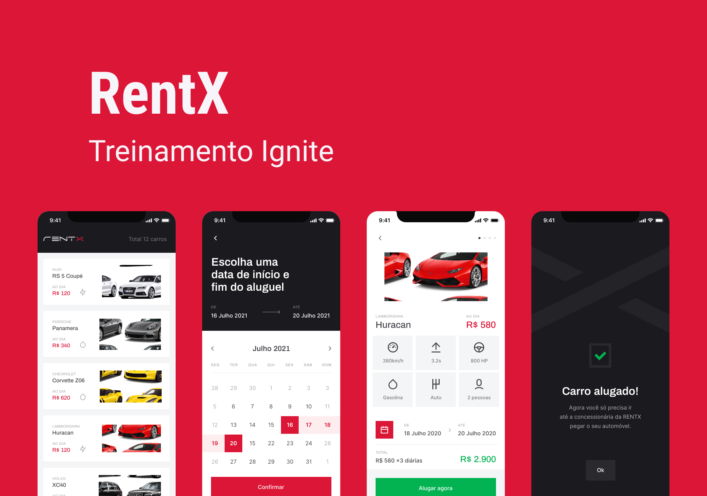
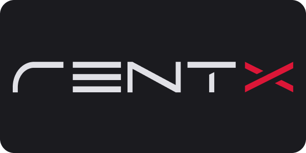

<h1 align="center">
    
</h1>


  ## 💻 Project

  [Rentx] Locação de Carro!

  Este é um projeto desenvolvido durante o **[IGNITE](https://rocketseat.com.br/ignite)** trilha [ReactNative](https://reactnative.dev/), apresentado por **[Rodrigo Gonçalves Santana](https://github.com/rodrigorgtic) / [@Rocketseat](https://rocketseat.com.br/)**.

  ## 🖥️ Layout

  Layout desenvolvido por [Tiago Luchtenberg](@tiagoluchtenberg) / [Layout Mobile](https://www.figma.com/file/4ojyGi2mGuQaGK0sUHMAqB/RentX-Ignite?node-id=0%3A1)

  Lembrando que você precisa ter uma conta [Figma](http://figma.com/) para acessá-lo.


<p align="center">
  

<br>

<p align="center">
  
</p>

## 🧪 Technologies

Este projeto foi desenvolvido utilizando as seguintes tecnologias:

- [ReactNative](https://reactnative.dev/)
- [TypeScript](https://www.typescriptlang.org/)
- [Expo](https://expo.io/)
- [Styled Component](https://styled-components.com/)

## 📚  O que Aprendemos - Chapter III

✔️ Módulo - Consumindo API - 07:32:06 em 32 aulas

✔️ Criação das Interfaces

- Apresentação do módulo - 02:49
- App que vamos codar - 05:35
- Criação do projeto e dica ninja - 23:49
- Tema Global da Aplicação - 17:00
- Criação do Header da Home - 20:12
- Criação do Card Car - 24:14
- Interface de Detalhes dos carros - 11:34
- Componente de Slider - 14:38
- Continuando a interface de Detalhes - 09:58
- Componente de Acessórios - 09:56
- Componente de Botão - 10:22
- Interface de Agendamento - 21:32
- Componente de Calendário - 21:42
- Interface de Detalhes do Agendamento - 18:51
- Heurísticas de Nielsen e UX - 13:48
- Interface de Agendamento Concluído - 14:38
- Navegação - 05:18
- Implementando a Navegação - 22:08

✔️ Consumindo API

- Introdução a API - 16:04
- Utilizando o JsonServer - 06:05
- Listando carros da API - 25:18
- Passando dados entre telas - 10:12
- Exibindo Icones Dinamicamente - 08:59
- Intervalos no Calendário - 25:47
- Finalizando o Calendário - 13:12
- Enviando Agendamento para API - 22:27
- Menu Flutuante - 06:33
- Listando Agendamentos do Usuário - 08:03
- Exibindo Carros Agendados - 13:18
- Reaproveitando o Componente Car - 13:34
- Usabilidade no Botão - 05:56
- Finalizando o botão - 08:34

✔️ Módulo - Animações - 03:00:01 em 17 aulas

- Introdução - 02:16
- Iniciando o Slide de Imagens - 08:07
- Obtendo a imagem em foco - 16:40
- Instalação Reanimated - 09:08
- React Native Reanimated - 07:25
- Primeira Animação - 13:24
- Transições - 09:23
- Splash Screen - 11:08
- Animando a Splash - 18:31
- Worklet Animation - 04:32
- Animando o Scroll - 13:22
- Melhorando o Scroll -14:02
- Gestos do Usuário - 25:17
- Previnir voltar a Splash - 05:29
- Lottie - 15:33
- A linha de chegada - 04:28
- Conclusão - 01:16

Dicas
- [Cubic Bezier](https://cubic-bezier.com/#.43,.49,.75,.75)
- [Lottie Files](https://lottiefiles.com/)
## 🚀 Getting started

Clone o projeto e acesse a pasta

```bash
$ git clone https://github.com/AndreBento/ignite-mobile-rentx.git && cd ignite-mobile-rentx
```

Siga os passos abaixo
```bash
# Install the dependencies
$ yarn

# Run the Expo server
$ expo start

# Run the Json Server
$ yarn api

```

## 📝 License

Este projeto está licenciado sob a Licença MIT. Consulte o arquivo de [LICENSE](LICENSE.md) para obter detalhes.

<p align="center">Feito por Carlos André Bento 🚀 </p>
